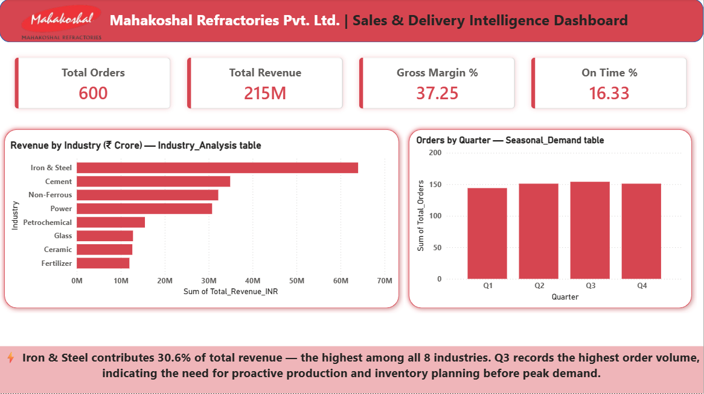
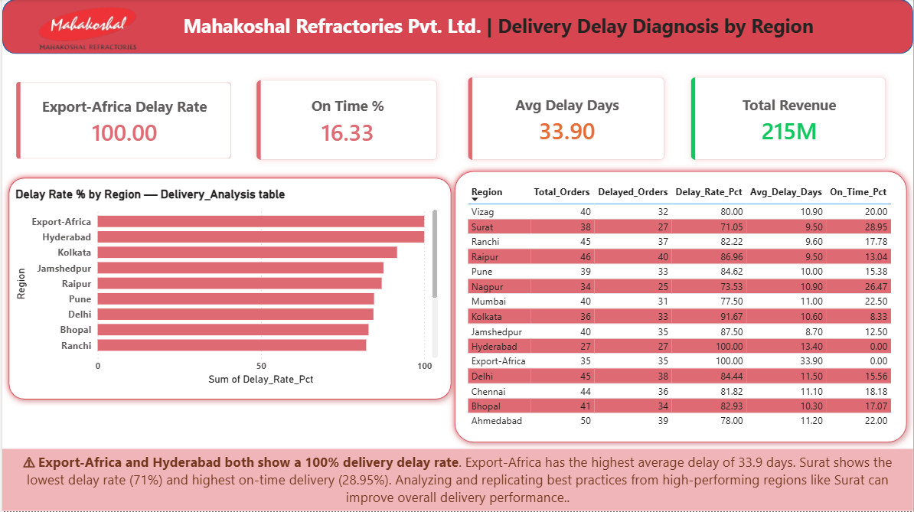
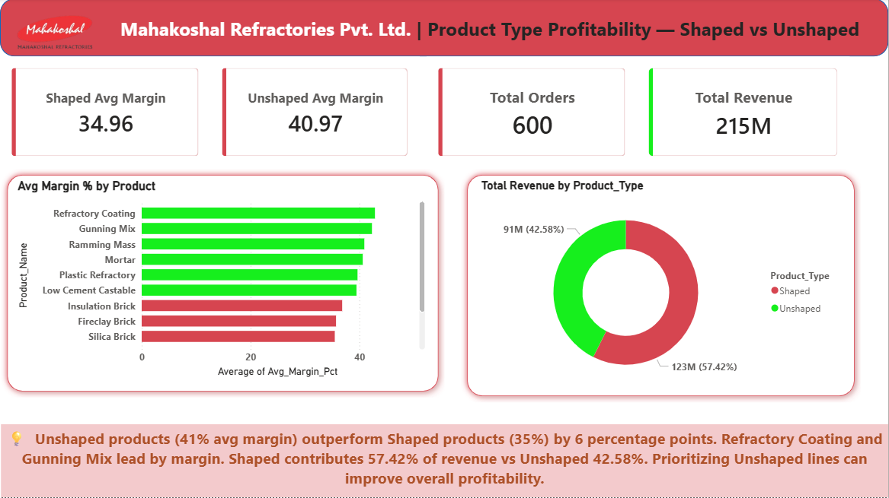
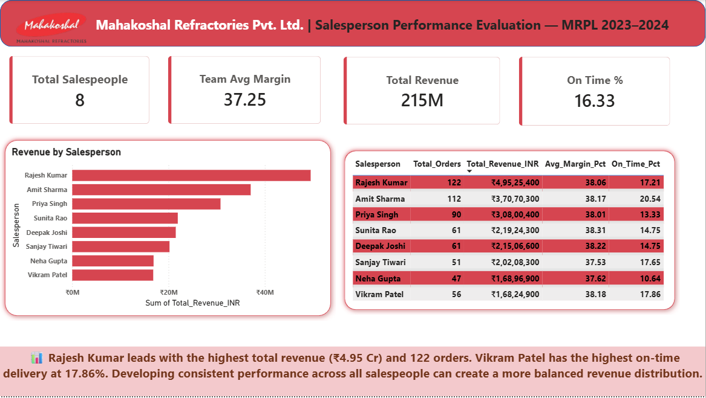

# Mahakoshal Refractories Pvt. Ltd. (MRPL) — Sales & Delivery Intelligence System

An end-to-end data analytics portfolio project built around **Mahakoshal Refractories Pvt. Ltd. (MRPL)**, a Katni (Madhya Pradesh)-based refractory manufacturer (ISO 9001:2015 & ISO 45001:2018 certified, Est. 1969), covering sales performance, delivery delay diagnosis, product profitability, seasonal demand, and salesperson evaluation across 8 industries and 15 regions.

This project simulates a real-world Data Analyst workflow — from raw data to business insight — using **Python, MySQL, and Power BI**.

---

## 📌 Business Context

MRPL manufactures refractory products used in high-temperature industrial processes across:

- **Industries:** Iron & Steel, Cement, Power, Non-Ferrous, Glass, Petrochemical, Ceramic, Fertilizer
- **Regions:** 15 regions across India including Export-Africa
- **Products:** 12 refractory products (Shaped and Unshaped categories)
- **Salespeople:** 8 field sales representatives

**Dataset:** 600 simulated sales orders covering Jan 2023 – Dec 2024, with revenue, cost, profit, delivery, and margin metrics per order.

---

## 🎯 Objective

To analyze sales revenue by industry, diagnose delivery delays by region, compare product profitability, identify seasonal demand patterns, and evaluate salesperson performance — and present actionable business insights for MRPL management.

---

## 🛠️ Tools & Skills Used

| Tool | Purpose |
|---|---|
| **Python (Jupyter Notebook)** | Data generation, EDA, and 5 matplotlib visualizations |
| **MySQL Workbench** | 5 business problem SQL queries with aggregations and window functions |
| **Power BI Desktop** | 4-page interactive dashboard with DAX measures and MRPL brand theme |
| **GitHub** | Version control and portfolio hosting |

---

## 🔑 Key Findings

- 🏭 **Iron & Steel** is MRPL's top industry at **29.8% of total revenue** — the most critical client segment
- ⚠️ **Export-Africa and Hyderabad** both show a **100% delivery delay rate** — every order was delivered late
- 📦 **Export-Africa** has the highest average delay of **33.9 days** across all regions
- ✅ **Surat** shows the lowest delay rate (71%) and highest on-time delivery (28.95%) — best performing region
- 💡 **Unshaped products** show **6% higher average gross margin** than Shaped products (41% vs 35%)
- 🥇 **Refractory Coating and Gunning Mix** are the top performers by margin among all 12 products
- 📅 **Q3 records the highest order volume** (154 orders) — indicating the need for proactive inventory planning
- 👤 **Rajesh Kumar** leads salesperson performance at **₹4.95 Crore revenue** with 122 orders
- ⚡ **Vikram Patel** has the highest on-time delivery rate at **17.86%** among all salespeople

---

## 📁 Repository Structure

```
mrpl-sales-delivery-intelligence/
│
├── 01_data/
│   ├── MRPL_Sales_Data.csv
│   └── MRPL_Sales_Analytics_Dataset.xlsx
│
├── 02_python_eda/
│   ├── MRPL_Python_Notebook.ipynb
│   ├── chart1_revenue_by_industry.png
│   ├── chart2_delivery_delay.png
│   ├── chart3_product_profitability.png
│   ├── chart4_seasonal_demand.png
│   └── chart5_salesperson_performance.png
│
├── 03_sql_queries/
│   └── MRPL_MySQL_Queries.sql
│
├── 04_powerbi_dashboard/
│   └── MRPL_Sales_Dashboard.pbix
│
├── screenshots/
│   ├── page1_executive.png
│   ├── page2_delivery.png
│   ├── page3_products.png
│   └── page4_salesperson.png
│
└── README.md
```

---

## 📊 Project Workflow

1. **Data Foundation** — Simulated a realistic 600-row sales dataset across industries, regions, products, and salespeople
2. **Python (EDA)** — Generated dataset, performed exploratory analysis, and exported 5 charts as PNG files
3. **MySQL** — Imported CSV into MySQL Workbench and ran 5 structured SQL queries to answer business problems
4. **Power BI** — Built a 4-page interactive dashboard with DAX measures and MRPL brand colors
5. **GitHub** — Organized all project files in a structured repository for portfolio hosting

---

## 🎯 5 Business Problems Solved

| # | Business Problem | Key Finding |
|---|---|---|
| 1 | Top Revenue-Generating Industries | Iron & Steel = 29.8% of total revenue |
| 2 | Delivery Delay Diagnosis by Region | Export-Africa & Hyderabad = 100% delay rate |
| 3 | Product Type Profitability | Unshaped = 6% higher margin than Shaped |
| 4 | Seasonal Demand Patterns | Q3 = highest order volume (154 orders) |
| 5 | Salesperson Performance Evaluation | Rajesh Kumar = top performer at ₹4.95 Crore |

---

## 📈 Power BI Dashboard Highlights

- Custom MRPL brand theme (Red `#C0392B`, Dark Red `#922B21`, Light Red `#FADBD8`)
- KPI cards: Total Orders, Total Revenue, Gross Margin %, On-Time Delivery %
- Bar chart: Revenue by Industry (Page 1)
- Bar chart: Delivery Delay Rate by Region (Page 2)
- Bar chart + Donut: Product margin comparison — Shaped vs Unshaped (Page 3)
- Bar chart + Table: Salesperson revenue ranking (Page 4)
- Data-supported insight box on every page






---

## 💡 Business Recommendations

1. Investigate and resolve delivery delays in Export-Africa and Hyderabad — both regions show 100% delay rate requiring immediate logistics intervention
2. Study and replicate Surat's delivery practices across underperforming regions — Surat shows the lowest delay rate and highest on-time delivery
3. Prioritize production and sales focus on Unshaped refractory products (Refractory Coating, Gunning Mix) given their 6% higher profit margin
4. Plan proactive inventory build-up before Q3 to meet peak demand without supply shortages
5. Develop consistent performance across mid-tier salespeople to reduce revenue concentration in top 3 performers

---

## 👤 About This Project

Built as a portfolio project to demonstrate end-to-end data analyst skills — from data generation and SQL querying to Python EDA and Power BI dashboarding — tailored specifically to a real regional manufacturing business.

**Author:** Animesh Yadav
**Contact:** animeshyadav310@gmail.com | https://www.linkedin.com/in/animesh-yadav-/
